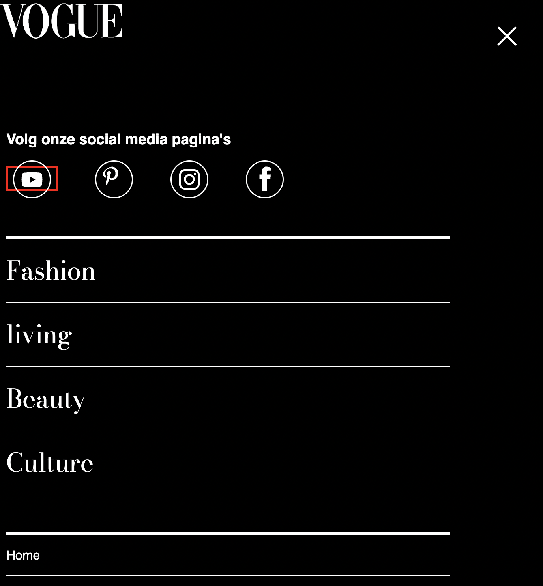

# Procesverslag

Markdown is een simpele manier om HTML te schrijven.  
Markdown cheat cheet: [Hulp bij het schrijven van Markdown](https://github.com/adam-p/markdown-here/wiki/Markdown-Cheatsheet).

Nb. De standaardstructuur en de spartaanse opmaak van de README.md zijn helemaal prima. Het gaat om de inhoud van je procesverslag. Besteedt de tijd voor pracht en praal aan je website.

Nb. Door _open_ toe te voegen aan een _details_ element kun je deze standaard open zetten. Fijn om dat steeds voor de relevante stuk(ken) te doen.

## Jij

  
uitwerken voor kick-off werkgroep

### Auteur:

Idelene Martis

#### Je startniveau:

blauw

#### Je focus:

responsive

## Je website

  
uitwerken voor kick-off werkgroep

### Je opdracht:

https://www.vogue.es/micros/tendencias-moda-anos-80/

#### Screenshot(s) van de eerste pagina (small screen):

hier de naam van de pagina  
 

#### Screenshot(s) van de tweede pagina (small screen):

Homepagina

## Toegankelijkheidstest 1/2 (week 1)

  
uitwerken na test in 1e werkgroep

### Bevindingen

Lijst met je bevindingen die in de test naar voren kwamen - test gedaan door Nina:
.bevat geen darkmode
.de 80tis feverpagina bevat geen header of footer
.moeilijk te bedienen met de rotator reden= omdat het te weing content bevat.
.kleurovergang niet opvallend genoeg voor mensen met kleurenblindheid(maar dit is puur vormgeving)
.Tab werk slecht bij het bedienen van de youtube video
.text en lay-out niet te lezen met blurred vision
.te weinig headings ( en ze hebben geen )

#### Screenreader

Hier korte omschrijving (met indien nodig afbeeldingen)

---

De Feverpagina valt niet te bedienen met de tab. foto,s worden overgeslagen en Video’s en teksten hebben geen waardevolle namen.
De links en/of de omschrijving hiervan zijn verwarrend.  
 

Hier een omschrijving van hoe het opgelost kan worden (met indien nodig afbeeldingen)

---

Ik denk dat dit op te lossen is door alle afbeeldingen een waardevolle ALT's te geven dan worden zij gedetecteerd door de screenreader. Het zou ook oplossing kunnen zijn om alle afbeelindgen en lappen tekst een titel/header te geven.

#### Muis en Toetsenbord

Hier korte omschrijving (met indien nodig afbeeldingen)

---

De 80tis Fever pagina valt bijna niet te bedienen met de tab
Video’s en teksten hebben geen waardevolle namen.
Een aantal links in de header zijn niet te bereiken met de tab alleen en het springt van hot en her.
De links en knoppen hebben geen hovers wel states

Hier een omschrijving van hoe het opgelost kan worden Muis en Toetsenbord (met indien nodig afbeeldingen)

---

Hoe kan ik dit oplossen? simpelweg door bij alle links een heldere omschrijving te bedenken.
(Zorgen dat ales met de tab toets te bedienen is) Ik ben onzeker over hoe ik dit onderdeel moet verbeteren.

Hovers aan de knoppen toevoegen

#### Motoriek (shocks, elastiekjes)

Hier korte omschrijving (met indien nodig afbeeldingen)

---

vanwege de mimialistishe aard van de website is het best makkelijk ok de website te bedienen.
wel zou ik bij de 80tis feverpagina meer hou vast willen geven want nu is naar links scroller best vervelend.

Hier een omschrijving van hoe het opgelost kan worden (met indien nodig afbeeldingen)

---

Als ik later toch problemen zou tegenkomen kan ik een aantal knoppen groter maken, in de hoop dat de website dan makkenlijker te bedienen is.

#### Visueel (brillen, contrast, kleurenblind, dark/light).

Hier korte omschrijving (met indien nodig afbeeldingen)

---

Kleurenblindheid
Bij deze test heb ik weinig zwakheden kunnen detecteren.
Na activeren van Emulate darkmode blijft alles goed leesbaar met uitzondering van de knoppen die zwart zijn.
Naast de afbeeldingen heeft de homepage website weinig kleur. Voornamelijk zwart/wit

Hier een omschrijving van hoe het opgelost kan worden (met indien nodig afbeeldingen)

---

## Breakdownschets (week 1)

  
uitwerken na afloop 2e werkgroep

### de hele pagina:

  

### dynamisch deel (bijv menu):

  

### wellicht nog een dynamisch deel (bijv filter):

  

## Voortgang 1 (week 2)

  
Ik ben vooral geholpen bij het correct aanroepen van elementen met bijvoorbeeld nth-of-type

### Stand van zaken

.ik vond het last om het ontzichtbare menu correct te positioneren hierbij heb ik hulp ontvangen.
.ook kreeg ik de tip om inplaats van 
-tjes, ::before/::after te gebruiken voor de strepen in mijn css

### Agenda voor meeting

samen met je groepje opstellen

donderdag 17:00
via een chatgroep delen waarmee wij worstelen.

| student 1 idelene | student 2          | student 3    | student 4        |
| ----------------- | ------------------ | ------------ | ---------------- |
| dit bespreken     | en dit             | en ik dit    | en dan ik dat    |
| en dat ook nog    | dit als er tijd is | nog een punt | dit wil ik zeker |
| ...               | ...                | ...          | ...              |

### Verslag van meeting

hier na afloop snel de uitkomsten van de meeting vastleggen

student: iedereen worstelt met correct aanroepen van html elementen.
student: iedereen de algmene vraag om te kijken of wij de goede kant op gaan.

## Voortgang 2 (week 3)

  
uitwerken voor 2e voortgang

### Stand van zaken

hier dit ging goed & dit was lastig (neem ook screenshots op van delen van je website en code)

### Agenda voor meeting

vrijdag 10:00 meeting in teams starten.

- al onze pagina's door een html validator laten inspeteren
- pagina's screen sharen en peerfeedback ontvangen. op correctheid van de code

| Laura | Idelene | Mohini | Shanine | Shani |

| --- | --- | --- | --- | --- |

| Animatie | Positionering | Responsiveness en de @media tag | Wanneer wel classes | pseudo elementen |

| En hoe het zit met de 2e pagina. | Alt labels | Stijlen van forms | Element dat vershuift als je scrolt |

| ... | ... | En het hamburgermenu | ... |

### Verslag van meeting

hier na afloop snel de uitkomsten van de meeting vastleggen

- punt idelene: is mijn html pagina screenreader proef hoe kan ik dit beter doen
- punt idelene: worstel met positioneren
- punt Laura: worstelt met animatie(kreeg tip van sjoer om met svg te werken)
- punt amber: wosterlt met mediaqueries
- punt sjoerd: vraagt zich af of hij meer classes mag gebruiken.
- het stijlen van vorm / hamburger menu.

## Toegankelijkheidstest 2/2 (week 4)

  
uitwerken na test in 8e werkgroep

### Bevindingen

Lijst met je bevindingen die in de test naar voren kwamen (geef ook aan wat er verbeterd is):

Nog aanpassen:

- Een aantal elemeten waren niet bereikbaar met de screanreader en/of tab.
- Onlogishe voorleesvolgorde met screenreader.

Dit gaat best goed:

- Ik heb nu een dark-mode yaay
- Ik heb meer states
- Ik heb skip-links
- Titels zijn groter en dus beter te lezen voor mensen met visuelebeperkingen

#### Screenreader

De screenreader slaat nu een aantal objecten over maar dat kwam omdat ik ze geen area-label heb toegevoegd, kreeg ik te horen van een mede-student.
Het is belangenrijk elke section een heading te geven met een duidenlijke omschrijving van de inhoud hiervan.
anders raken gebruikers gemakkelijk de weg kwijt.

#### Muis en Toetsenbord

Je kan alleen tabben door interactive elementen en dat waren een heleboel elementen op mijn pagina niet. Dat ga ik aanpassen

#### Motoriek (shocks, elastiekjes) Hier korte omschrijving (met indien nodig afbeeldingen)

De website was goed te bedien met beperkte moteriek.
Ik heb de links en dergelijke iets groter gemaakt
Doordat ik mijn links iets groter heb gemaakt dan het origineel werk mijn webstie iets meer vergevend als mensen niet gelijk over de link kunnen hoveren om het aan te klikken met een huis

#### Visueel (brillen, contrast, kleurenblind, dark/light).

Bij mijn eerst pagina ziet dark-mode er tot op hede goed uit volgens mijn test partner. heb daar hoge contrast
alleen twijfel ik of ik de belichting van de afbeeldingen omlaag zal gooien aangezien dit het weer moeilijker te zien zal zijn.

Mijn teksten zijn groter dus goed leesbaar voor mensen met wazige zicht alleen.

Omdat ik voornamenlijk zwart wit gebruik kunnen alle vormen van kleuren blind heid mijn knoppen en links goed zien en lezen

  

 

## Voortgang 3 (week 4)

  
uitwerken voor 3e voortgang

### Stand van zaken

hier dit ging goed & dit was lastig (neem ook screenshots op van delen van je website en code)
-Body-bg bedekken sections kaderlijnen op de homepagina
-Grid voegt te veel wit ruimte toe.
-Interaction observer wilt niet werken.

### Agenda voor meeting

samen met je groepje opstellen

| student 1 idelene | student 2          | student 3    | student 4        |     |
| ----------------- | ------------------ | ------------ | ---------------- | --- |
| dit bespreken     | en dit             | en ik dit    | en dan ik dat    |
| en dat ook nog    | dit als er tijd is | nog een punt | dit wil ik zeker |
| ...               | ...                | ...          | ...              |

### Verslag van meeting

hier na afloop snel de uitkomsten van de meeting vastleggen

- punt 1: idelene: problemen met het werkend maken van de intersection observer api
- punt 2: idelene: waarom mijn body de kader-lijnen van mijn secties bedeken.
- nog een punt
- punt 2: donna vraag over carrosel
- punt 3 sjoerd vraag over het images in buttons
- punt 4 laura vraag over een afbeelding wissel met javascript
- ...

## Eindgesprek (week 5)

  
uitwerken voor eindgesprek

### Je uitkomst - karakteristiek screenshots:

  

### Dit ging goed/Heb ik geleerd:

Korte omschrijving met plaatjes

- Een sroll interactie toeveogen: de header verdwijned als je naar beneden scrollt
  (het is apart dat ik worstelde met classList.add want ik heb bij 2 elementen op de pagina een soortgelijk methode gebruikt en daar lukte het wel)
- Een uit klap menu maken
- Het selecteren en positioneren van elementen. dit vond ik voeger lastig nu lukt het me wel.
- Display flex.

  

### Dit was lastig/Is niet gelukt:

- de intersection oberser Api voor op de 2de pagina. ik wou een scroll animatie toevoegen maar het lukte me niet om met classlist.add de class aan de desbetreffenende element te koppelen. dus dat gaf ik op. 
  ik heb ook proberen een animatie toe te voegen dat gelijk afspeeld naar laden van de pagina maar dat lukte ook niet.
  

- ik kreeg niet alles goed focusable. hiermee bedoel ik dat bij een aantal elementen de outline het object niet mooi omkaderd

- grid vond ik ook best lastig. ik kreeg in week 2 volgens mij het advies bepaalde sections met een grid te stijlen. maar ik kreeg toen ik dat deed onder een aantal grid elementen heel veel wit ruitme. dus besloot ik om het met flex te doen omdat mij dat makkenlijker af ging.

-Bij de @media query preffered dark blijven een aantal elementen de stijling behouden van de light mode.

## Bronnenlijst

  
continu bijhouden terwijl je werkt

Nb. Wees specifiek ('css-tricks' als bron is bijv. niet specifiek genoeg).

1. bron [voor de boxshadows] https://codepen.io/greypants/pen/nRaZJB?editors=1100

2. bron met behulp van Sundous [ centreren met calc()] https://developer.mozilla.org/en-US/docs/Web/CSS/calc

3. bron voor gebruikte verlopen - https://developer.mozilla.org/en-US/docs/Web/CSS/gradient/linear-gradient

4.dispay grid met behulp van Sanne -https://codepen.io/shooft/pen/zYjEPrd

5.[ bron voor de verlegenheader ] https://webdesign.tutsplus.com/tutorials/how-to-hide-reveal-a-sticky-header-on-scroll-with-javascript--cms-33756

6. [bron voor de animaties 80fever pagina]

7. [ bron voor de hamburger knoppen] https://codepen.io/shooft/pen/dymRMBZ

8. [bron voor de hover animatie op de fever pagina] https://codepen.io/shooft/pen/KKorGPa

9. [verberg element bron] https://www.a11yproject.com/posts/how-to-hide-content/

