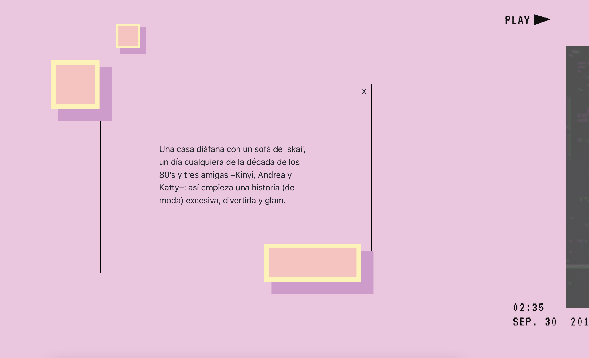

# Procesverslag
Markdown is een simpele manier om HTML te schrijven.  
Markdown cheat cheet: [Hulp bij het schrijven van Markdown](https://github.com/adam-p/markdown-here/wiki/Markdown-Cheatsheet).

Nb. De standaardstructuur en de spartaanse opmaak van de README.md zijn helemaal prima. Het gaat om de inhoud van je procesverslag. Besteedt de tijd voor pracht en praal aan je website.

Nb. Door *open* toe te voegen aan een *details* element kun je deze standaard open zetten. Fijn om dat steeds voor de relevante stuk(ken) te doen.

## Jij

  
uitwerken voor kick-off werkgroep

  ### Auteur:
  Idelene Martis

  #### Je startniveau:
  blauw

  #### Je focus:
  responsive
 

## Je website

  
uitwerken voor kick-off werkgroep

  ### Je opdracht:
  https://www.vogue.es/micros/tendencias-moda-anos-80/

  #### Screenshot(s) van de eerste pagina (small screen): 
  hier de naam van de pagina  
  

  #### Screenshot(s) van de tweede pagina (small screen):
  Homepagina 
  
 

## Toegankelijkheidstest 1/2 (week 1)

  
uitwerken na test in 1e werkgroep

  ### Bevindingen
  Lijst met je bevindingen die in de test naar voren kwamen - test gedaan door Nina:
  .bevat geen darkmode
  .de 80tis feverpagina bevat geen header of footer
  .moeilijk te bedienen met de rotator reden= omdat het te weing content bevat.
  .kleurovergang niet opvallend genoeg voor mensen met kleurenblindheid(maar dit is puur vormgeving)
  .Tab werk slecht bij het bedienen van de youtube video
  .text en lay-out niet te lezen met blurred vision
  .te weinig headings ( en ze hebben geen )
  
 
  #### Screenreader
  Hier korte omschrijving (met indien nodig afbeeldingen)
  -------------------------------
  De Feverpagina valt niet te bedienen met de tab. foto,s worden overgeslagen en Video’s en teksten hebben geen waardevolle namen. 
  De links en/of de omschrijving hiervan zijn verwarrend.      
  

  Hier een omschrijving van hoe het opgelost kan worden (met indien nodig afbeeldingen)
  -------------------------------
  Ik denk dat dit op te lossen is door alle afbeeldingen een waardevolle ALT's te geven dan worden zij gedetecteerd door de screenreader. Het zou ook oplossing kunnen zijn om alle afbeelindgen en lappen tekst een titel/header te geven.

  #### Muis en Toetsenbord 
  Hier korte omschrijving (met indien nodig afbeeldingen)
  -------------------------------
  De 80tis Fever pagina valt bijna niet te bedienen met de tab
  Video’s en teksten hebben geen waardevolle namen. 
  Een aantal links in de header zijn niet te bereiken met de tab alleen en het springt van hot en her. 
  De links en knoppen hebben geen hovers wel states

  Hier een omschrijving van hoe het opgelost kan worden Muis en Toetsenbord (met indien nodig afbeeldingen)
  -------------------------------
  Hoe kan ik dit oplossen? simpelweg door bij alle links een heldere omschrijving te bedenken.
  (Zorgen dat ales met de tab toets te bedienen is) Ik ben onzeker over hoe ik dit onderdeel moet verbeteren. 

  Hovers aan de knoppen toevoegen

  #### Motoriek (shocks, elastiekjes)
  Hier korte omschrijving (met indien nodig afbeeldingen)
  -------------------------------
  vanwege de mimialistishe aard van de website is het best makkelijk ok de website te bedienen.
  wel zou ik bij de 80tis feverpagina meer hou vast willen geven want nu is naar links scroller best vervelend.

  Hier een omschrijving van hoe het opgelost kan worden (met indien nodig afbeeldingen)
  -------------------------------
  Als ik later toch problemen zou tegenkomen kan ik een aantal knoppen groter maken, in de hoop dat de website dan makkenlijker te bedienen is.

  #### Visueel (brillen, contrast, kleurenblind, dark/light). 
  Hier korte omschrijving (met indien nodig afbeeldingen)
  -------------------------------
  Kleurenblindheid
  Bij deze test heb ik weinig zwakheden kunnen detecteren. 
  Na activeren van Emulate darkmode blijft alles goed leesbaar met uitzondering van de knoppen die zwart zijn.
  Naast de afbeeldingen heeft de homepage website weinig kleur.  Voornamelijk zwart/wit
  
  

  Hier een omschrijving van hoe het opgelost kan worden (met indien nodig afbeeldingen)
  -------------------------------

## Breakdownschets (week 1)

  
uitwerken na afloop 2e werkgroep

  ### de hele pagina: 
  

  ### dynamisch deel (bijv menu): 
  

  ### wellicht nog een dynamisch deel (bijv filter): 
  

## Voortgang 1 (week 2)

  
Ik ben vooral geholpen bij het correct aanroepen van elementen met bijvoorbeeld nth-of-type

  ### Stand van zaken
  .ik vond het last om het ontzichtbare menu correct te positioneren hierbij heb ik hulp ontvangen.
  .ook kreeg ik de tip om inplaats van 
-tjes, ::before/::after te gebruiken voor de strepen in mijn css 

  ### Agenda voor meeting
  samen met je groepje opstellen

  donderdag 17:00
  via een chatgroep delen waarmee wij worstelen.

  ### Verslag van meeting
  hier na afloop snel de uitkomsten van de meeting vastleggen

   student: iedereen worstelt met correct aanroepen van html elementen.
   student: iedereen de algmene vraag om te kijken of wij de goede kant op gaan.

## Voortgang 2 (week 3)

  
uitwerken voor 2e voortgang

  ### Stand van zaken
  hier dit ging goed & dit was lastig (neem ook screenshots op van delen van je website en code)

  ### Agenda voor meeting
  vrijdag 10:00 meeting in teams starten.

  - al onze pagina's door een html validator laten inspeteren
  - pagina's screen sharen en peerfeedback ontvangen. op correctheid van de code

  

  ### Verslag van meeting
  hier na afloop snel de uitkomsten van de meeting vastleggen

  
- punt idelene: is mijn html pagina screenreader proef hoe kan ik dit beter doen
- punt idelene: worstel met positioneren
- punt Laura: worstelt met animatie(kreeg tip van sjoer om met svg te werken)
- punt amber: wosterlt met mediaqueries
- punt sjoerd: vraagt zich af of hij meer classes mag gebruiken.

## Toegankelijkheidstest 2/2 (week 4)

  
uitwerken na test in 8e werkgroep

  ### Bevindingen
  Lijst met je bevindingen die in de test naar voren kwamen (geef ook aan wat er verbeterd is):

  #### Screenreader
  Hier korte omschrijving (met indien nodig afbeeldingen)

  Hier een omschrijving van hoe het opgelost kan worden (met indien nodig afbeeldingen)

  #### Muis en Toetsenbord 
  Hier korte omschrijving (met indien nodig afbeeldingen)

  Hier een omschrijving van hoe het opgelost kan worden (met indien nodig afbeeldingen)

  #### Motoriek (shocks, elastiekjes)
  Hier korte omschrijving (met indien nodig afbeeldingen)

  Hier een omschrijving van hoe het opgelost kan worden (met indien nodig afbeeldingen)

  #### Visueel (brillen, contrast, kleurenblind, dark/light). 
  Hier korte omschrijving (met indien nodig afbeeldingen)

  Hier een omschrijving van hoe het opgelost kan worden (met indien nodig afbeeldingen)

## Voortgang 3 (week 4)

  
uitwerken voor 3e voortgang

  ### Stand van zaken
  hier dit ging goed & dit was lastig (neem ook screenshots op van delen van je website en code)

  ### Agenda voor meeting
  samen met je groepje opstellen

  | student 1      | student 2          | student 3    | student 4        |
  | ---            | ---                | ---          | ---              |
  | dit bespreken  | en dit             | en ik dit    | en dan ik dat    |
  | en dat ook nog | dit als er tijd is | nog een punt | dit wil ik zeker |
  | ...            | ...                | ...          | ...              |

  ### Verslag van meeting
  hier na afloop snel de uitkomsten van de meeting vastleggen

  - punt 1
  - punt 2
  - nog een punt
  - ...

## Eindgesprek (week 5)

  
uitwerken voor eindgesprek

  ### Je uitkomst - karakteristiek screenshots:
  

  ### Dit ging goed/Heb ik geleerd: 
  Korte omschrijving met plaatjes

  

  ### Dit was lastig/Is niet gelukt:
  Korte omschrijving met plaatjes

  

## Bronnenlijst

  
continu bijhouden terwijl je werkt

  Nb. Wees specifiek ('css-tricks' als bron is bijv. niet specifiek genoeg).

  1. bron 1
  2. bron 2
  3. ...

